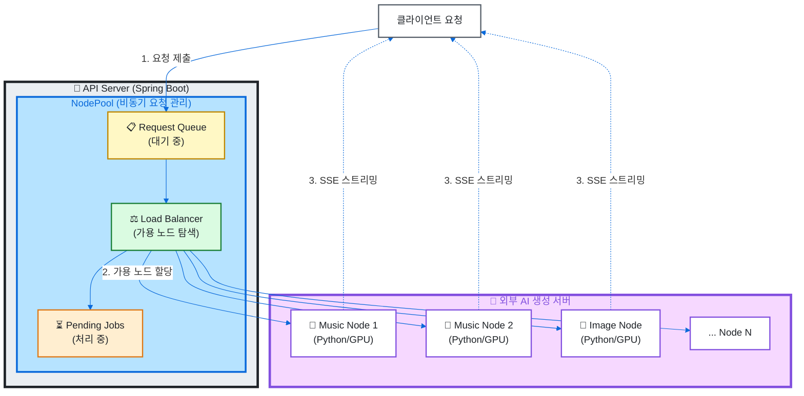
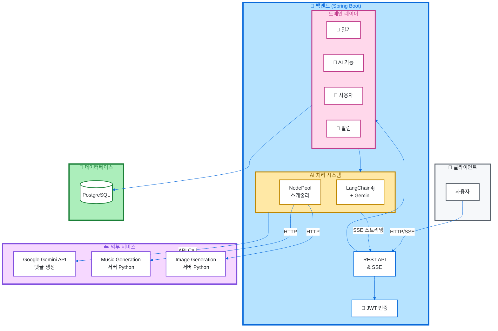

# 🌟 Memoria

> AI가 함께하는 공감 일기장 서비스

[](https://openjdk.org/)
[](https://spring.io/projects/spring-boot)
[](https://www.postgresql.org/)
[](https://docs.langchain4j.dev/)
[](./LICENSE)

## 📖 프로젝트 소개

Memoria는 **AI 기술을 활용한 감성 일기장 플랫폼**입니다. 사용자의 일기에 AI가 공감하며 댓글을 달고, 일기 내용을 바탕으로 맞춤형 음악과 이미지를 생성합니다. 친구들과 함께 일기장을 공유하며 추억을 기록할 수 있습니다.

### ✨ 주요 기능

- 📝 **일기 작성 및 공유**: 개인 일기 작성, DiaryBook을 통한 그룹 일기장 공유
- 🤖 **AI 감성 댓글**: LangChain4j + Gemini를 활용한 공감 댓글 자동 생성
- 🎵 **AI 음악 생성**: 일기 내용 기반 배경음악 자동 생성 (SSE 스트리밍)
- 🎨 **AI 이미지 생성**: 일기 내용을 시각화한 이미지 생성
- 💬 **소셜 기능**: 댓글, 반응, 스티커로 감정 표현
- 🔔 **실시간 알림**: SSE(Server-Sent Events) 기반 실시간 알림 시스템
- 👥 **초대 시스템**: 친구 초대 및 DiaryBook 멤버 관리
- 📊 **통계**: 사용자 활동 통계 및 분석

## 🏗️ 기술적 하이라이트

### 🎯 외부 AI 노드 스케줄링 시스템

Memoria의 핵심 기술은 **외부 AI 생성 서버(Node)를 효율적으로 관리하는 NodePool 시스템**입니다.

#### 주요 특징



#### 구현 기술

- **비동기 처리**: Java 21 Virtual Thread 활용한 경량 동시성 처리
- **로드 밸런싱**: 가용 노드 자동 탐색 및 요청 분산
- **재시도 메커니즘**: 실패한 요청에 대한 자동 재시도 로직
- **요청 취소**: DiaryId 기반 연관 요청 일괄 취소 기능
- **큐 관리 API**: 큐 순서 변경, 우선순위 조정, 요청 제거
- **SSE 스트리밍**: 생성 진행 상황 실시간 전송

<details>
<summary><b>핵심 코드 구조 살펴보기</b></summary>

```java
public abstract class AbstractAsyncNodePool<REQ, RES> implements NodePool<REQ, RES> {
    private final Queue<NodePoolQueueItem<REQ, RES>> requestQueue = new ConcurrentLinkedQueue<>();
    private final Map<String, NodePoolQueueItem<REQ, RES>> pendingJobs = new ConcurrentHashMap<>();

    // Virtual Thread를 활용한 효율적인 동시성 처리
    private final ExecutorService threadPool = Executors.newVirtualThreadPerTaskExecutor();

    // 가용 노드 자동 탐색 및 요청 분산
    private void processRequestQueue() {
        Optional<Node> availableNode = nodes.stream()
                .filter(Node::isAvailable)
                .findFirst();

        if (availableNode.isPresent()) {
            NodePoolQueueItem<REQ, RES> toProcess = requestQueue.poll();
            threadPool.submit(() -> handleRequest(toProcess, availableNode.get()));
        }
    }

    // DiaryId 기반 연관 요청 일괄 취소
    public int cancelRequestsByDiaryId(Long diaryId) {
        requestQueue.removeIf(item -> diaryId.equals(item.getDiaryId()));
        pendingJobs.entrySet().removeIf(entry -> diaryId.equals(entry.getValue().getDiaryId()));
        // ...
    }
}
```

</details>

#### 확장성

- 노드 동적 추가/제거 지원
- 다양한 AI 서비스 통합 가능 (Music, Image, Video, etc.)
- 서비스별 별도 NodePool 운영 (MusicNodePool, ImageNodePool)

## 🛠️ 기술 스택

### Backend
- **Language**: Java 21 (Virtual Thread)
- **Framework**: Spring Boot 3.4.5
  - Spring Data JPA
  - Spring Security (JWT 인증)
  - Spring WebFlux (SSE 스트리밍)
- **Database**: PostgreSQL
- **ORM**: Hibernate + QueryDSL

### AI/ML
- **LangChain4j**: AI 워크플로우 오케스트레이션
- **Google AI Gemini**: LLM (댓글 생성, 프롬프트 엔지니어링)
- **Custom Node Pool**: 외부 AI 서버 스케줄링

### DevOps
- **Build**: Gradle
- **Documentation**: SpringDoc OpenAPI (Swagger)
- **Container**: Docker

## 🏛️ 시스템 아키텍처



## 📦 프로젝트 구조

```
src/main/java/ac/mju/memoria/
├── backend/
│   ├── domain/
│   │   ├── ai/              # AI 기능 (댓글, 이미지, 음악)
│   │   │   ├── controller/
│   │   │   ├── service/
│   │   │   ├── llm/         # LangChain4j 통합
│   │   │   └── networking/  # NodePool 구현
│   │   │       ├── music/   # 음악 생성 NodePool
│   │   │       └── image/   # 이미지 생성 NodePool
│   │   ├── diary/           # 일기 관리
│   │   ├── diarybook/       # 공유 일기장
│   │   ├── auth/            # 인증/인가
│   │   ├── user/            # 사용자 관리
│   │   ├── notification/    # 실시간 알림 (SSE)
│   │   ├── invitation/      # 초대 시스템
│   │   └── file/            # 파일 업로드
│   ├── system/
│   │   ├── security/        # JWT 인증 시스템
│   │   ├── configuration/   # 설정
│   │   └── exception/       # 예외 처리
│   └── common/              # 공통 유틸리티
└── MemoriaApplication.java
```

## 🚀 시작하기

### 사전 요구사항

- Java 21 이상
- PostgreSQL 14 이상
- Gradle 8.x

### 환경 변수 설정

```bash
# application.yml 또는 환경 변수 설정
SPRING_DATASOURCE_URL=jdbc:postgresql://localhost:5432/memoria
SPRING_DATASOURCE_USERNAME=your_username
SPRING_DATASOURCE_PASSWORD=your_password

# JWT Secret
JWT_SECRET=your-secret-key

# Google AI (Gemini)
GOOGLE_AI_API_KEY=your-gemini-api-key

# AI Node 서버 주소
AI_MUSIC_NODE_URLS=http://music-node-1:8080,http://music-node-2:8080
AI_IMAGE_NODE_URLS=http://image-node-1:8080
```

### 빌드 및 실행

```bash
# 의존성 설치 및 빌드
./gradlew build

# 애플리케이션 실행
./gradlew bootRun

# Docker로 실행
docker build -t memoria-backend .
docker run -p 8080:8080 memoria-backend
```

### API 문서

애플리케이션 실행 후 Swagger UI에서 API 문서를 확인할 수 있습니다.

```
http://localhost:8080/swagger-ui.html
```

## 📊 주요 API 엔드포인트

| 기능 | Method | Endpoint | 설명 |
|------|--------|----------|------|
| 일기 작성 | POST | `/api/diaries` | 새로운 일기 작성 |
| AI 댓글 생성 | POST | `/api/ai/comments` | 일기에 AI 댓글 생성 |
| AI 음악 생성 | POST | `/api/ai/music` | 일기 기반 음악 생성 |
| AI 이미지 생성 | POST | `/api/ai/images` | 일기 기반 이미지 생성 |
| 음악 큐 조회 | GET | `/api/ai/music/queue` | 음악 생성 대기열 조회 |
| 음악 큐 관리 | PUT | `/api/ai/music/queue/{uuid}` | 큐 순서 변경 |
| SSE 연결 | GET | `/api/sse/subscribe` | 실시간 알림 구독 |
| DiaryBook 생성 | POST | `/api/diarybooks` | 공유 일기장 생성 |

## 🎯 핵심 구현 내용

### 1. NodePool 기반 AI 요청 관리
- 외부 AI 서버와의 효율적인 통신 및 로드 밸런싱
- 비동기 처리 및 요청 큐 관리
- Virtual Thread를 활용한 고성능 동시성 처리

### 2. SSE 기반 실시간 스트리밍
- 음악/이미지 생성 진행 상황 실시간 전달
- 알림 시스템 구현
- 다중 클라이언트 동시 지원

### 3. LangChain4j 통합
- Gemini API를 활용한 AI 댓글 생성
- 일기 내용 분석 및 감정 추출
- 프롬프트 엔지니어링을 통한 자연스러운 응답 생성

### 4. JWT 기반 인증 시스템
- 커스텀 JWT 필터 구현
- Refresh Token을 통한 보안 강화
- Spring Security 통합

### 5. 이벤트 기반 아키텍처
- Spring Events를 활용한 도메인 간 느슨한 결합
- 일기 삭제 시 연관 AI 요청 자동 취소
- 비동기 이벤트 처리

## 🤝 기여

이 프로젝트는 명지대학교 캡스톤 프로젝트입니다.

## 📄 라이선스

이 프로젝트는 MIT 라이선스 하에 배포됩니다. 자세한 내용은 [LICENSE](./LICENSE) 파일을 참조하세요.

## 📧 문의

프로젝트에 대한 문의사항은 Issues를 통해 남겨주세요.

---

<div align="center">

**Made with ❤️ by Capstone-Memoria Team**

</div>
